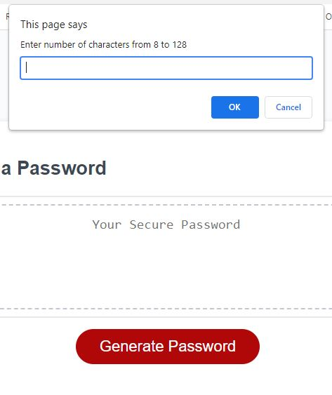
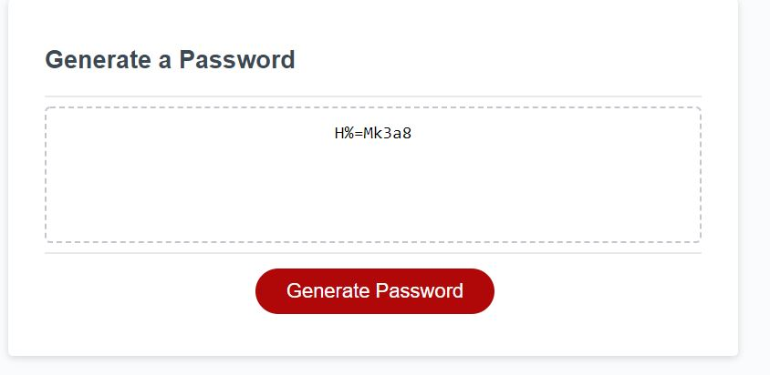

## Description
After taking in user criteria, the app will generate a pseudo-random password at the requested lengths and with the requested character sets. Then the programatically generated password is randomized before being presented to the user. The app can be run repreatidly, allowing new password criteria.

## Link
https://derotto54.github.io/homework_03/

## Screenshots

